# KS0464 Smart Turtle Robot Car V3.0

## 1. Introduction

Nowadays, technological education such as VR, kids programming, and artificial
intelligence, has become mainstream in educational industry. Thereby, people
attach importance to STEAM education.

The turtle multi-purpose robot car, newly upgraded by the Keyes team, is one of
the most favoured programming robots.

It is not only beautiful in appearance, but also powerful in function. In
addition to the common function like line tracking, obstacle avoidance and
remote control, etc.

15 learning projects, from simple to complex, will guide you how to make a smart
turtle robot on you own and introduce the detailed knowledge about sensors and
modules.

Simultaneously, it is the best choice if you intend to obtain a DIY robot for
learning programming, entertainment and competition requirement.

## 2. Features

1.Multi-purpose function: Obstacle avoidance, follow, IR remote control,
Bluetooth control, ultrasonic follow and displayed face emoticons.

2.Simple assembly: No soldering circuit required, complete assembly easily.

3.High Tenacity: Aluminum alloy bracket, metal motors, high quality wheels and
tracks

4.High extension: expand other sensors and modules through motor driver shield
and sensor shield

5.Multiple controls: IR remote control, App control(IOS and Android system)

6.Basic programming：Mixly programming.

## 3. Specification

Working voltage: 5v

Input voltage: 7-12V

Maximum output current: 2A

Maximum power dissipation: 25W (T=75℃)

Motor speed: 5V 200 rpm/min

Motor drive mode: dual H bridge drive

Ultrasonic induction angle: \<15 degrees

Ultrasonic detection distance: 2cm-400cm

Infrared remote control distance: 10 M (at the open environment without
interference)

Bluetooth remote control distance: 35-50 M at the open environment without
interference)

Bluetooth control: support Android and iOS system

## 4. Product List

## 5. Assembly Guide

**Note: Peel the plastic film off the board first when installing the smart car.
To be honest, we never intend to send wood to you.**

**Step 1: Mount Motor Wheel**

-   M3\*6MM Round Head Screw \*2

-   M3\*6MM Flat Head Screw \*2

-   M3 Nickel Plated Nut \*2

-   Bottom PCB\*1

-   Tracking Sensor \*1

-   Universal Caster \*2

**Step 2: Assemble Parts**

Prepare the parts as follows:

-   M3\*6MM Round Head Screw \*2

-   M2 Nut \*4

-   12FN20 Motor \*2

-   U-type Holder\* 2

-   N20 Motor Wheel \*2

-   2P Wire \*2

-   5P Wire \*1

-   M2\*12MM Round Head Screw \*4

-   2-cell AA Battery Holder \*1

-   M3\*6M Flat Head Screw \*2

-   M3 Nut \*2

**Step 3: Install Top PCB**

Prepare the parts as follows:

-   Top PCB \*1

-   M3 Nut \*1

-   M3\*6MM Round Head Screw \*9

-   M3\*10MM Hexagon Copper Bush \*8

-   IR Receiver Sensor \*1

**Step 4: Mount Control Board**

Prepare the parts as follows:

-   V4.0 board\*1

-   Motor Drive Shield V2\*1

-   M3\*6MM Round Head Screw \*4

M3\*6MM round-head screw \*4

**Step 5: Servo Plastic Platform**

Prepare the parts as follows:

-   Servo \*1

-   M2\*4 Screw \*1

-   Black Tie\*2

-   Ultrasonic Sensor\*1

-   Black Plastic Platform \*1

-   M1.2\*4 Tapping Screw \*4

-   M2\*8 Tapping Screw \*2

**Step 6: Final Assembly**

Prepare the parts as follows:

-   M3\*6MM Round Head Screw \*12

-   M3\*40MM Hexagon Copper Bush\*4

-   8x8 Dot Matrix \*1

-   Jumper Wire \*4

**Step 7: Hook-up Guide**

!

## **6.Install Mixly Software and Driver**

1.  **Download and Install Mixly**

①Description

Mixly is a free open-source graphical Arduino programming software, based on
Google’s Blockly graphical programming framework, and developed by Mixly Team@
BNU.

It is a complete support ecosystem for creative e-education, a stage for maker
educators to realize their dreams.

② Download Mixly1.0

Windows System：https://fs.keyestudio.com/Mixly1-Windows

MACOS System：https://fs.keyestudio.com/Mixly1-MACOS

We will take Mixly1.0 (Windows version) as example, and the installation method
of MAC version is similar with it.

You will get installation package after downloading. As shown below:

Unzip the package, you will see “Mixly 1.0 for keyestudio.exe”

Double-click ”Mixly 1.0 for
keyestudio.exe”, the following interface pops up.

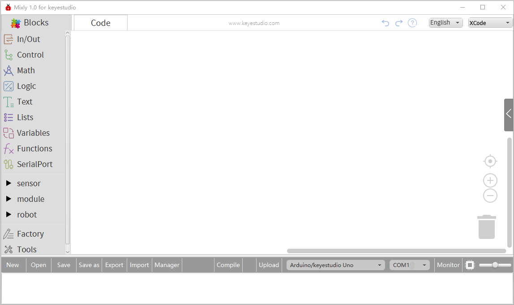

We have to choose correct Arduino development board and name, as shown below:

Select correct COM port(the corresponding port will be shown after installing
driver successfully)

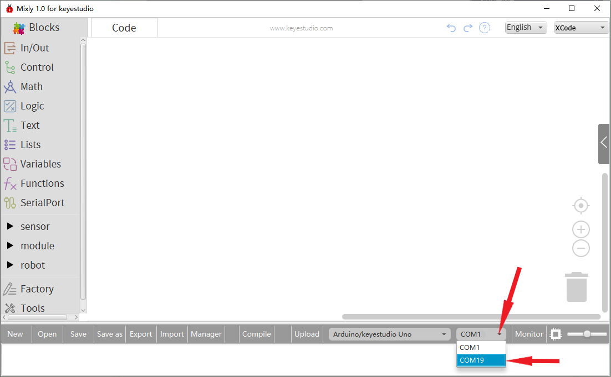

You have to know the function of every area and interface on Mixly software
before uploading program on Arduino development board.

1.  **Keyestudio V4.0 Development Board**

We need to know keyestudio V4.0 development board, as a core of this smart car.

Keyestudio V4.0 development board is an Arduino uno -compatible board, which is
based on ATmega328P MCU, and with a CP2102 Chip as a UART-to-USB converter.

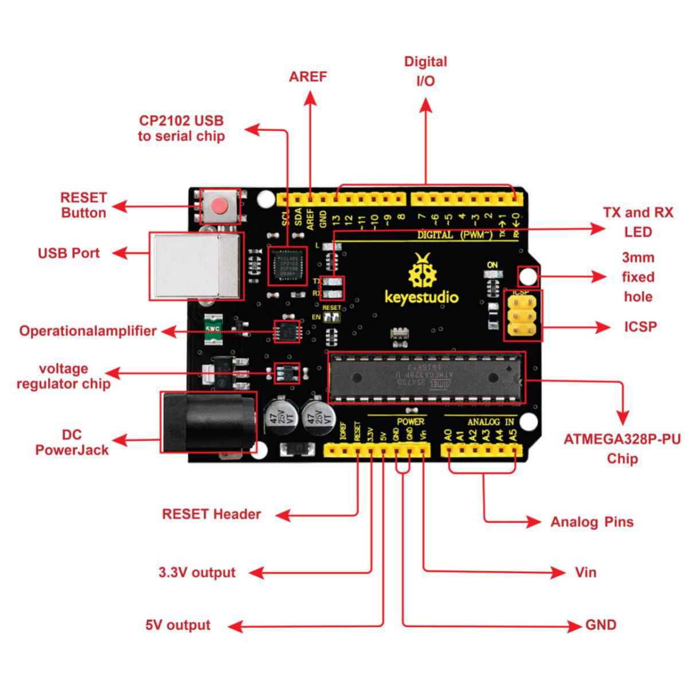

It has 14 digital input/output pins (of which 6 can be used as PWM outputs), 6
analog inputs, a 16 MHz quartz crystal, a USB connection, a power jack, 2 ICSP
headers and a reset button.

It contains everything needed to support the microcontroller; simply connect it
to a computer with a USB cable or power it via an external DC power jack (DC
7-12V) or via female headers Vin/ GND(DC 7-12V) to get started.

| Microcontroller             | ATmega328P-PU                               |
|-----------------------------|---------------------------------------------|
| Operating Voltage           | 5V                                          |
| Input Voltage (recommended) | DC7-12V                                     |
| Digital I/O Pins            | 14 (D0-D13) (of which 6 provide PWM output) |
| PWM Digital I/O Pins        | 6 (D3, D5, D6, D9, D10, D11)                |
| Analog Input Pins           | 6 (A0-A5)                                   |
| DC Current per I/O Pin      | 20 mA                                       |
| DC Current for 3.3V Pin     | 50 mA                                       |
| Flash Memory                | 32 KB (ATmega328P-PU)                       |
| SRAM                        | 2 KB (ATmega328P-PU)                        |
| EEPROM                      | 1 KB (ATmega328P-PU)                        |
| Clock Speed                 | 16 MHz                                      |
| LED_BUILTIN                 | D13                                         |

1.  **Installing V4.0 board Driver**

Let’s install the driver of keyestudio V4.0 board. The USB-TTL chip on V4.0
board adopts CP2102 serial chip. The driver program of this chip is included in
Arduino 1.8 version and above, which is convenient. Plug on USB port of board,
the computer can recognize the hardware and automatically install the driver of
CP2102.

If install unsuccessfully, or you intend to install manually, open the device
manager of computer. Right click Computer----- Properties----- Device Manager

There is a yellow exclamation mark on the page, which implies installing
unsuccessfully. Then we double click the hardware and update the driver.

Click “OK” to enter the following page, click “browse my computer for updated
driver software”, find out the installed or downloaded ARDUINO software. As
shown below:

There is a DRIVERS folder in Arduino software installed
package（）, open driver folder
and you can see the driver of CP210X series chips.

We click “Browse”, then find out the driver folder, or you could enter “driver”
to search in rectangular box, then click “next”, the driver will be installed
successfully. (I place Arduino software folder on the desktop, you could follow
my way)

Open device manager, we will find the yellow exclamation mark disappear. The
driver of CP2102 is installed successfully.

**(4) Start the first program**

Click“Open”→ sample → arduino→ Arduino → 01 IN-OUT→01-LED Blink.mix

The corresponding board and COM port will be shown after setting board and COM
port.

Click **Compile** to start compiling the program, check errors.

Click **Upload** to upload the program, upload successfully.

After uploading the program successfully, the on-board LED blinks for 1s.
Congratulation, you finish the first program.

## 7. Projects:

The whole project begins with basic program. Starting from simple to complex,
the lessons will guide you to assemble robot car and absorb the knowledge of
electronic and machinery step by step. I reckon that you could hardly sit still
and itch to have a go, let’s get started.

Note: (G), marked on each sensor and module, implies negative pole, which is
connected to “G”, ”-”or “GND”on the sensor shield and control board ; (V)
represents positive pole, which is linked with V , VCC, + or 5V on the sensor
shield and control board.

### Project 1: LED Blink

  **Description**

For the starter and enthusiast, this is a fundamental program---LED Blink.

LED, the abbreviation of light emitting diodes, consist of Ga, As, P, N chemical
compound and so on. The LED can flash diverse color by altering the delay time
in the test code. When in control, power on GND and VCC, the LED will be on if S
end is high level; nevertheless, it will go off.

1.  **Specification**

-   Control interface:

-   digital port

-   Working voltage: DC 3.3-5V

-   Pin spacing: 2.54mm

-   LED display color: red

1.  **Components**

1.  **Wiring Diagram**

The expansion board is stacked on development board, - of LED module is
connected to G of shield,“+”is linked with 5V, S end is attached to D3.

1.  **Test Code：**

The program will be generated if you find the following file and drag it into
Mixly software.

| File type | Route                                               |
|-----------|-----------------------------------------------------|
| MIX File  | ../tutorial for Mixly/Mixly Code/lesson_1_LED Blink |
|           | File Name                                           |
|           | lesson_1.1_LED Blink                                |

You could edit code step by step as follows:

1.  Enter“Control”to get block

2.  Click“Sensor” →
    “ControlOutput”→，and combine
    it with block，

3.  S end of red LED is connected D3 of sensor shield, click the drop-down
    triangle button to set PIN 3 and LOW.

1.  Copy
    blockonce，and set to HIGH

1.  Click “Control” to drag out
    block

1.  Duplicate code
    stringonce，and set to LOW.

Complete Program：

1.  **Test Result：**

Upload the program, LED connected to D9 flickers with the interval of 1s.

1.  **Extension Practice：**

We succeed to blink LED. Next, let’s observe how LED will change if we modify
pins and delay time.

The program will be generated if you find the following file and drag it into
Mixly software.

| File type | Route                                               |
|-----------|-----------------------------------------------------|
| MIX File  | ../tutorial for Mixly/Mixly Code/lesson_1_LED blink |
|           | File Name                                           |
|           | lesson_1.2_Extension Practice                       |

You could edit code step by step as follows:

Complete Program：

 

The LED flickers faster through the test result, therefore, pins and delay time
could affect flash frequency.

### Project 2: Adjust LED Brightness

1.  **Description：**

In previous lesson, we control LED on and off and make it blink.

In this project, we will control LED brightness through PWM to simulate
breathing effect. Similarly, you can change the step length and delay time in
the code so as to demonstrate different breathing effect.

PWM is a means of controlling the analog output via digital means. Digital
control is used to generate square waves with different duty cycles (a signal
that constantly switches between high and low levels) to control the analog
output.In general, the input voltage of port are 0V and 5V. What if the 3V is
required? Or what if switch among 1V, 3V and 3.5V? We can’t change resistor
constantly. For this situation, we need to control by PWM.

For the Arduino digital port voltage output, there are only LOW and HIGH, which
correspond to the voltage output of 0V and 5V. You can define LOW as 0 and HIGH
as 1, and let the Arduino output five hundred 0 or 1 signals within 1 second.

If output five hundred 1, that is 5V; if all of which is 1, that is 0V. If
output 010101010101 in this way then the output port is 2.5V, which is like
showing movie. The movie we watch are not completely continuous. It actually
outputs 25 pictures per second. In this case, the human can’t tell it, neither
does PWM. If want different voltage, need to control the ratio of 0 and 1. The
more 0,1 signals output per unit time, the more accurately control.

PWM is a technology to obtain analog quantity through digital method. Digital
control forms a square wave, and the square wave signal only has two states of
turning on and off (that is, high or low levels). By controlling the ratio of
the duration of turning on and off, a voltage varying from 0 to 5V can be
simulated. The time turning on(academically referred to as high level) is called
pulse width, so PWM is also called pulse width modulation.

Through the following five square waves, let’s acknowledge more about PWM.

In the above figure, the green line represents a period, and value of
analogWrite() corresponds to a percentage which is called Duty Cycle as well.
Duty cycle implies that high-level duration is divided by low-level duration in
a cycle. From top to bottom, the duty cycle of first square wave is 0% and its
corresponding value is 0. The LED brightness is lowest, that is, turn off. The
more time high level lasts, the brighter the LED. Therefore, the last duty cycle
is 100%, which correspond to 255, LED is brightest. 25% means darker.

PWM mostly is used for adjusting the LED brightness or rotation speed of motor.

It plays vital role in controlling smart robot car. I believe that you can’t
wait to enter next project.

1.  **Components**

1.  **Wiring Diagram**

1.  **Test Code：**

The program will be generated if you find the following file and drag it into
Mixly software.

| File type | Route                                                           |
|-----------|-----------------------------------------------------------------|
| MIX File  | ../tutorial for Mixly/Mixly Code/lesson_2_Adjust LED Brightness |
|           | File Name                                                       |
|           | lesson_2.1_Adjust LED Brightness                                |

You could edit code step by step as follows:

1.  Click“Control” to get block

2.  Go
    to“sensor”→“ControlOutput”→
    →，and set to LOW

1.  Red LED is connected to D3, so set to PIN 3 and LOW

(4) Enter“Control”to get
block，set block:

(5) Enter “In/Out” to get
block，

(6) Click “Variables” to move
blockinto 0 box behind value.

(7) Click ”Control”to move
blockinto
block，delay in 5ms.

1.  Copy code
    stringonce，set code
    
    string as follows:
    

Complete Program：

1.  **Test Result：**

Upload test code successfully, LED gradually becomes brighter then darker, like
human breath, rather than light on and off immediately.

1.  **Extension Practice：**

The program will be generated if you find the following file and drag it into
Mixly software.

| File type | Route                                                           |
|-----------|-----------------------------------------------------------------|
| MIX File  | ../tutorial for Mixly/Mixly Code/lesson_2_Adjust LED Brightness |
|           | File Name                                                       |
|           | lesson_2.2_Extension Practice                                   |

You could edit code step by step as follows:

Complete Program：

Upload the code to development board, LED flickers more slowly.

### Project 3 : Line Tracking Sensor

1.  **Description：**

The tracking sensor is actually an infrared sensor. The component used here is
the TCRT5000 infrared tube.

Its working principle is to use the different reflectivity of infrared light to
the color, then convert the strength of the reflected signal into a current
signal.

During the process of detection, black is active at HIGH level, but white is
active at LOW level. The detection height is 0-3 cm.

Keyestudio 3-channel line tracking module has integrated 3 sets of TCRT5000
infrared tube on a single board, which is more convenient for wiring and
control.

By rotating the adjustable potentiometer on the sensor, it can adjust the
detection sensitivity of the sensor.

1.  **Specification**

Operating Voltage: 3.3-5V (DC)

Interface: 5PIN

Output Signal: Digital signal

Detection Height: 0-3 cm

Special note: before testing, turn the potentiometer on the sensor to adjust the
detection sensitivity. When adjust the LED at the threshold between ON and OFF,
the sensitivity is the best.

1.  **Components**

1.  **Connection Diagram：**

**5. Test Code：**

The program will be generated if you find the following file and drag it into
Mixly software.

| File type | Route                                                           |
|-----------|-----------------------------------------------------------------|
| MIX File  | ../tutorial for Mixly/Mixly Code/ lesson_3_Line Tracking Sensor |
|           | File Name                                                       |
|           | lesson_3.1_Line Tracking Sensor                                 |

You could edit code step by step as follows:

1.  Click “Control” to get block

2.  Enter “Serial port” to move
    blockinto
    block.

(3) Go to “Variables” to moveinto
blockfor three times；then enter
“Math” to drag block and copy it
for 3 times.

(4) Combine with
block, and separately set to
val_L, val_M and val_R.

(5) Enter “Variables” to move out
block，

1.  Go to “Sensor” → “DigitalRead”
    →

2.  Integrate
    blockwith
    block.

3.  The line tracking sensor is linked with D6, so set to PIN 11.

4.  Replicate
    blocktwice，and separately
    change val_L into val_M and val_R;

5.  The tracking sensor is also connected to D7 and D8, therefore, set to PIN 7
    and PIN 8

1.  Click “Serial Port”to drag out
    block，and go to “Text” to
    move blockinto
    block，

2.  Change hello into
    left：+=

3.  Copy blockagain，and
    enter“Variables”to move
    blockinto

4.  Replicate code once and
    delete left：， as shown below:

1.  Duplicate code
    stringonce，and change
    left：into middle : , val_L into val_M.

2.  Copy block，and alter
    left：into right：

3.  Go to“Serial Port”to drag
    outblock ，and enter
    “Variables” to drag into
    block.

1.  Enter “Control” to get block,
    and delay in 500ms.

Complete Program：

**6. Test Result**

Upload the code on development board, open serial monitor to check line tracking
sensors. And the displayed value is 1(high level) when no signals are received.
The value becomes into 0 when covering sensor with paper.

1.  **Code explanation:**

Serial.begin(9600)-initialize and set baud rate to 9600

pinMode- decide if the pin mode of micron controller is input or output.

digitalRead- read the status of pin(HIGH, LOW)

1.  **Extension Practice**

After knowing its working principle, connect an LED to D3. We could control LED
by line tracking sensor.

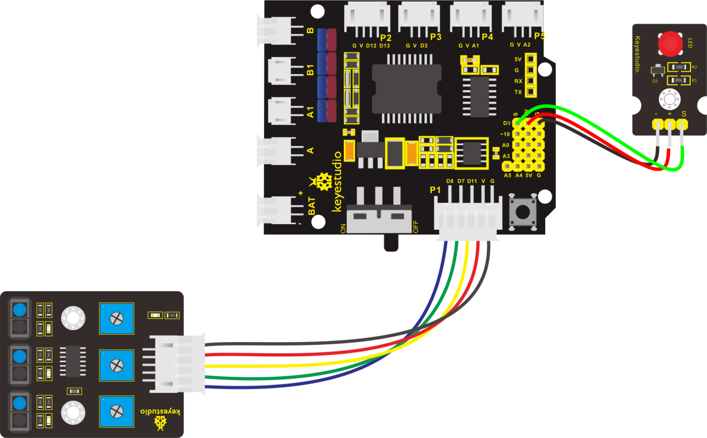

The program will be generated if you find the following file and drag it into
Mixly software.

| File type | Route                                                           |
|-----------|-----------------------------------------------------------------|
| MIX File  | ../tutorial for Mixly/Mixly Code/ lesson_3_Line Tracking Sensor |
|           | File Name                                                       |
|           | lesson_3.2_Extension Practice                                   |

You could edit code step by step as follows:

(1) Click “Control” to get block

(2) Enter “Serial Port” to move
blockinto

+
=

1.  Go to “Variables” to drag out
    blockand copy it twice

2.  Separately change item into val_L, val_M and val_R.

3.  Go to “Math” to move out
    blockand replicate it twice.

Edit code string as follows:

1.  Go to “Variables” to drag out
    block，

2.  Then click “Sensor” → “DigitalRead”
    →

3.  Move blockinto
    block，

4.  The line tracking sensor is linked with D6, so set to PIN 11.

5.  Replicate
    blocktwice，and separately
    change val_L into val_M and val_R;

6.  The tracking sensor is also connected to D7 and D8, therefore, set to PIN 7
    and PIN 8

1.  Click “Serial Port” to drag out
    block，and go to “Text” to
    move blockinto
    block，

2.  Change hello into
    left：+
    =

3.  Copy blockagain，and
    enter“Variables”to move
    blockinto
    .

4.  Replicate code once and
    delete left：， as shown below:

1.  Duplicate code
    stringonce，and change
    left：into middle : , val_L into val_M.

2.  Copy block，and alter
    left：into right：

3.  Go to“Serial Port”to drag
    outblock ，and enter
    “Variables” to drag into
    block.

1.  Enter“Control”to move out
    block，
    clickto move
    block
    intoblock，
    thenblock turns
    into.

2.  Go to “Logic” to move
    blockinto if block.

3.  Enter “Variables” to drag
    blockinto the left box of
    block“=”，click “Math” to move
    blockinto right box
    of“=”，and change 0 into 1.

1.  Go to “sensor” → “ControlOutput”
    →

2.  Place it into do block，and set to LOW

3.  LED is linked with D3，therefore, set to PIN 9.

4.  Copy
    blockagain and keep it into
    else

5.  Then set to HIGH, click ”Control” to move out
    block，and delay in 2000ms.

(27) Replicate code
stringtwice，and
respectively set to val_M and
val_R.

Complete Program：

\| 

Initialization Set baud rate to 9600 Set val_L to integer 0 Set val_M to integer
0 Set val_R to integer 0 Set the digital signals read by left TCRT5000 IR tube
to val_L Set the digital signals read by middle TCRT5000 IR tube to val_M Set
the digital signals read by right TCRT5000 IR tube to val_R Serial port prints
left： Serial port displays the digital signals read by left TCRT5000 IR tube
Serial port prints blank space Serial port prints middle： Serial Port shows the
digital signals read by middle TCRT5000 IR tube Serial port prints blank space
Serial port prints right： Serial port displays the digital signals read by
right TCRT5000 IR tube If the digital signal read by right TCRT5000 IR tube is
1, the program under do block will be executed. Turn off red LED If the digital
signal read by left TCRT5000 IR tube is not 1, the program under else block will
be executed. Light up red LED Delay in 2000ms If the digital signal read by
middle TCRT5000 IR tube is 1, the program under do block will be executed. LED
Turn off red LED If the condition of digital signal read by left TCRT5000 IR
tube=1 is not met, the program under else block will be executed. Delay in
2000ms If the condition of digital signal read by right TCRT5000 IR tube=1 is
met, the program under do block will be executed. LED Turn off red LED If the
condition of digital signal read by middle TCRT5000 IR tube=1 is not met, the
program under else block will be executed. Light up red LED Delay in 2000ms \|

Upload the code to development board, we could see LED light up when covering
the line tracking sensor by hand.

### Project 4: Servo Control

1.  **Description**

Servo motor is a position control rotary actuator. It mainly consists of
housing, circuit board, core-less motor, gear and position sensor. Its working
principle is that the servo receives the signal sent by MCU or receiver and
produces a reference signal with a period of 20ms and width of 1.5ms, then
compares the acquired DC bias voltage to the voltage of the potentiometer and
obtain the voltage difference output.

When the motor speed is constant, the potentiometer is driven to rotate through
the cascade reduction gear, which leads that the voltage difference is 0, and
the motor stops rotating. Generally, the angle range of servo rotation is 0°
\--180 °

The rotation angle of servo motor is controlled by regulating the duty cycle of
PWM (Pulse-Width Modulation) signal. The standard cycle of PWM signal is 20ms
(50Hz). Theoretically, the width is distributed between 1ms-2ms, but in fact,
it's between 0.5ms-2.5ms. The width corresponds the rotation angle from 0° to
180°. But note that for different brand motor, the same signal may have
different rotation angle.

In general, servo has three line in brown, red and orange. Brown wire is
grounded, red one is positive pole line and orange one is signal line.

The corresponding servo angles are shown below:

1.  **Specification**

Working voltage: DC 4.8V \~ 6V

Operating angle range: about 180 ° (at 500 → 2500 μsec)

Pulse width range: 500 → 2500 μsec

No-load speed: 0.12 ± 0.01 sec / 60 (DC 4.8V) 0.1 ± 0.01 sec / 60 (DC 6V)

No-load current: 200 ± 20mA (DC 4.8V) 220 ± 20mA (DC 6V)

Stopping torque: 1.3 ± 0.01kg · cm (DC 4.8V) 1.5 ± 0.1kg · cm (DC 6V)

Stop current: ≦ 850mA (DC 4.8V) ≦ 1000mA (DC 6V)

Standby current: 3 ± 1mA (DC 4.8V) 4 ± 1mA (DC 6V)

1.  **Components**

1.  **Wiring Diagram**

Wiring note: the brown line of servo is linked with Gnd(G), the red line is
connected to 5v(V) and orange line is attached to digital 10.

The servo has to be connected to external power due to its high demand for
driving servo current. Generally, the current of development board is not
enough. If without connected power, the development board could be burnt.

1.  **Test Code**

The program will be generated if you find the following file and drag it into
Mixly software.

| File type | Route                                                    |
|-----------|----------------------------------------------------------|
| MIX File  | ../tutorial for Mixly/Mixly Code/ lesson_4_Servo Control |
|           | File Name                                                |
|           | lesson_4_Servo Control                                   |

You could edit code step by step as follows:

1.  Go to“Control”to get block

2.  Enter“Module”→“Drive_Module”to get
    blockand place it into
    block，

3.  The servo is linked with D10, so set to PIN 10.

4.  Set servo to 90°，and delay in 500ms.

5.  Replicate code string for
    three times，respectively change 90 into 0, 180 and 0.

Complete Program：

Upload code successfully and power on, servo swings in the range of 0° to 180°.

### Project 5: Ultrasonic Sensor

1.  **Description**

The HC-SR04 ultrasonic sensor uses sonar to determine distance to an object like
bats do. It offers excellent non-contact range detection with high accuracy and
stable readings in an easy-to-use package. It comes complete with ultrasonic
transmitter and receiver modules.

The HC-SR04 or the ultrasonic sensor is being used in a wide range of
electronics projects for creating obstacle detection and distance measuring
application as well as various other applications. Here we have brought the
simple method to measure the distance with Arduino and ultrasonic sensor and how
to use ultrasonic sensor wit h Arduino.

1.  **Specification**

-   Power Supply :+5V DC

-   Quiescent Current : \<2mA

-   Working Current: 15mA

-   Effectual Angle: \<15°

-   Ranging Distance : 2cm – 400 cm

-   Resolution : 0.3 cm

-   Measuring Angle: 30 degree

-   Trigger Input Pulse width: 10uS

1.  **Components**

1.  **The principle of ultrasonic sensor**

As the above picture shown, it is like two eyes. One is transmitting end, the
other is receiving end.

The ultrasonic module will emit the ultrasonic waves after trigger signal. When
the ultrasonic waves encounter the object and are reflected back, the module
outputs an echo signal, so it can determine the distance of object from the time
difference between trigger signal and echo signal.

The t is the time that emitting signal meets obstacle and returns.

and the propagation speed of sound in the air is about 343m/s, therefore,
distance = speed \* time, because the ultrasonic wave emits and comes back,
which is 2 times of distance, so it needs to be divided by 2, the distance
measured by ultrasonic wave = (speed \* time)/2

1.  Use method and timing chart of ultrasonic module:

2.  Setting the delay time of Trig pin of SR04 to 10μs at least, which can
    trigger it to detect distance.

3.  2\. After triggering, the module will automatically send eight 40KHz
    ultrasonic pulses and detect whether there is a signal return. This step
    will be completed automatically by the module.

4.  3\. If the signal returns, the Echo pin will output a high level, and the
    duration of the high level is the time from the transmission of the
    ultrasonic wave to the return.

Circuit diagram of ultrasonic sensor:

1.  **Connection Diagram**

****

Wiring guide:

Ultrasonic sensor keyestudio V5 sensor shield

VCC → 5v(V)

Trig → 12(S)

Echo → 13(S)

Gnd → Gnd(G)

1.  **Test Code**

The program will be generated if you find the following file and drag it into
Mixly software.

| File type | Route                                                       |
|-----------|-------------------------------------------------------------|
| MIX File  | ../tutorial for Mixly/Mixly Code/lesson_5_Ultrasonic Sensor |
|           | File Name                                                   |
|           | lesson_5.1_Ultrasonic Sensor                                |

You could edit code step by step as follows:

1.  Click“Control”module to get
    block.

2.  Enter“Serial Port”to move
    blockinto
    block.

1.  Go to“Variables” to get
    blockand copy it twice.
    Respectively change item into distance 1 and distance 2.

(4) Click“Math” to move out
blockand replicate it twice.

(5) Click “Variables” to drag out
block，and enter “sensor” →
“OtherSensor” →.

(6) Combine block with block
，

(7) Trig pin of ultrasonic sensor is connected to D12(S) of shield，Echo is
attached to D13(S)，so set Trig 12 and Echo 13.

(8) Click“Variables”to get
block，and drag
out from“Math” and keep it behind
block.

(9) Go to“Variables” to move out
blockleft 1 box“.

(10) Then change another 1 into 0.3937，and set to“×”.

(11) Go to“Serial Port ” to drag out
block，and click “Variables” to
get block.

(12) Combine  with

(13) Go to “Serial Port” to get
block，then click “Text” module
to drag blockinto
，and change hello into in.

(14) Copy code stringonce，change
distance2 into distance1，in into cm

(15) Click“Control”to get
block，delay in 50ms.

(16) Click“Control”to get
block，delay in 50ms.

Complete Program：

1.  **Extension Practice：**

We have measured the distance displayed by ultrasonic sensor. How about
controlling the LED with the measured distance? Let's try it, connect an LED
light module to the D3 pin.

The program will be generated if you find the following file and drag it into
Mixly software.

| File type | Route                                                       |
|-----------|-------------------------------------------------------------|
| MIX File  | ../tutorial for Mixly/Mixly Code/lesson_5_Ultrasonic Sensor |
|           | File Name                                                   |
|           | lesson_5.2_Extension Practice                               |

You could edit code step by step as follows:

1.  Enter“Control” to get block

(2) Click“Serial Port” to drag out
blockinto

(3) Go to“Variables” to move out
blockand copy it twice.

(4) Enter“Math” to drag out
blockand replicate twice, and
change item into distance 1 and distance 2.

(5) Edit the code string as follows:

(6) Go to “Variables” to move
outblock，then click“sensor”→
“OtherSensor” →

(7) Combine it with block，the
pin Trig of ultrasonic sensor is linked with D12(S) of expansion board, pin Echo
is attached to D13(S); therefore, click the triangle button to select 12 and 13.

(8) Click“Variables” to get
block，and drag
out from “Math” and keep it
behind block.

(9) Go to“Variables” to move out
blockleft 1 box“.

Then change another 1 into 0.3937，and set to “×”.

(10) Go to “Serial Port ” to drag out
block，and click “Variables” to
get block.

(11) Combine  with

(12) Go to “Serial Port” to get
block，then click “Text” module
to drag blockinto
，and change hello into in.

(13) Replicate code string
once，and change distance2 into
distance1，and in into cm.

(14) Go to“Control”to move out
blockand delay in 50ms

(15) Click“Control” and drag it into
block，
clickand
moveinto
then we get
block.

(16) Go to “Logic” to get  and
.

(17) Place into if block，and
leave  in the left box of
block.

(18) Enter“Variables” to get
block and keep it at left box of
block “=”.

(19) Go to “Math” to move outinto
right box of block “=”，and change 0 into 2, “=” into “≥”.

(20) Replicate blockonce and set

(21) Go to“Control”to move out
blockand delay in 50ms

(22) Click“Control”and drag it into
block，
clickand
moveinto
then we get
block.

(23) Go to “Logic” to get  and
.

(24) Place into if block，and
leave  in the left box of
block.

(25) Enter “Variables” to get
block and keep it at left box of
block“=”.

(26) Go to“Math” to move outinto
right box of block “=”，and change 0 into 2, “=”into“≥”.

(27) Replicate blockonce and set

(28) Click “sensor”
→“ControlOutput”→and place it
into do block，

(29) The S end of LED Module is connected to D3 of expansion board，therefore,
click the triangle button to select 3.

(30) Replicate
blockonce and leave it into
“else” and set to LOW.

Complete Program：

Upload test code to development board and block ultrasonic sensor by hand, then
check if LED is on

1.  **Test Result：**

Upload test code on the development board, open serial monitor and set baud rate
to 9600. The detected distance will be displayed, the unit is cm and inch.
Hinder the ultrasonic sensor by hand, the displayed distance value gets smaller.

**Project 6: IR Reception**

1.  **Description**

There is no doubt that infrared remote control is ubiquitous in daily life. It
is used to control various household appliances, such as TVs, stereos, video
recorders and satellite signal receivers. Infrared remote control is composed of
infrared transmitting and infrared receiving systems, that is, an infrared
remote control and infrared receiving module and a single-chip microcomputer
capable of decoding.​

The 38K infrared carrier signal emitted by remote controller is encoded by the
encoding chip in the remote controller. It is composed of a section of pilot
code, user code, user inverse code, data code, and data inverse code. The time
interval of the pulse is used to distinguish whether it is a 0 or 1 signal and
the encoding is made up of these 0, 1 signals.

The user code of the same remote control is unchanged. The data code can
distinguish the key.

When the remote control button is pressed, the remote control sends out an
infrared carrier signal. When the IR receiver receives the signal, the program
will decode the carrier signal and determines which key is pressed. The MCU
decodes the received 01 signal, thereby judging what key is pressed by the
remote control.

Infrared receiver we use is an infrared receiver module. Mainly composed of an
infrared receiver head, it is a device that integrates reception, amplification,
and demodulation. Its internal IC has completed demodulation, and can achieve
from infrared reception to output and be compatible with TTL signals.
Additionally, it is suitable for infrared remote control and infrared data
transmission. The infrared receiving module made by the receiver has only three
pins, signal line, VCC and GND. It is very convenient to communicate with
arduino and other microcontrollers.

1.  **Specification**

Operating Voltage: 3.3-5V（DC）

Interface: 3PIN

Output Signal: Digital signal

Receiving Angle: 90 degrees

Frequency: 38khz

Receiving Distance: 10m

1.  **Components**

1.  **Connection Diagram**

Respectively link “-”, “+” and S of IR receiver module with G(GND）, V（VCC）and
A0 of keyestudio development board.

Attention: On the condition that digital ports are not available, analog ports
can be regarded as digital ports. A0 equals to D14, A1 is equivalent to digital
15.

1.  **Test Code**

The program will be generated if you find the following file and drag it into
Mixly software.

| File type | Route                                                   |
|-----------|---------------------------------------------------------|
| MIX File  | ../tutorial for Mixly/Mixly Code/ lesson_6_IR Reception |
|           | File Name                                               |
|           | lesson_6.1_IR Reception                                 |

You could edit code step by step as follows:

(1) Enter “Control” Module to get
block.

(2) Click “Serial Port”Module to drag
blockinto
block.

(3) Go to
“Module”→”Communicate_Module”→，

(4) Signal end of IR receiver module is connected to A1 of shield, therefore,
click triangle button to select A0.

(5) Click “Control” Module，to
moveout, delay in 100ms

Complete Program：

1.  **Test Result**

Upload test code, open serial monitor and set baud rate to 9600, point remote
control to IR receiver and the corresponding value will be shown, if pressing so
long, the error codes will appear.

Below we have listed out each button value of keyestudio remote control. So you
can keep it for reference.

1.  **Extension Practice:**

We decoded the key value of IR remote control. How about controlling LED by the
measured value? We could operate an experiment to affirm. Attach an LED to D3,
then press the keys of remote control to make LED light up and off.

The program will be generated if you find the following file and drag it into
Mixly software.

| File type | Route                                                   |
|-----------|---------------------------------------------------------|
| MIX File  | ../tutorial for Mixly/Mixly Code/ lesson_6_IR Reception |
|           | File Name                                               |
|           | lesson_6.2_Extension Practice                           |

You could edit code step by step as follows:

1.  Enter“Control”module to get
    block.

2.  Go to“Serial Port”to move out
    blockinto
    block.

3.  

4.  Go to
    ”Module”→”Communicate_Module”→

5.  S end of IR receiver module is linked with A0. therefore, click triangle
    button to set A0.

1.  Go to “Variables” to move
    blockinto
    block，

2.  Go to“Math”to drag out
    blockand integrate with
    , then change item into a.

1.  Click “Control”module to get
    block，
    click，
    moveinto
    block，
    thenturns
    intoblock.

2.  Go to “Logic”，and find out
    block. Leave it behind if
    block

3.  Go to“Logic” to placein the
    left box.

4.  Click“Variables” to move in
    the left box of“=” block，go to“Math” to drag
    outinto right box of
    “=”，then change 0 into 0xFF02FD.

5.  Copyonce and keep it into
    right box of ”and” block，change ir_item into a，0xFF02FD into 0.

1.  Click “sensor”→
    “ControlOutput”→

2.  Keep it into the first do block，S end of red LED module is linked with D3
    of expansion board，and set to Pin 3.

1.  Go to“Variables”to move
    below“Red_LED...HIGH”block.

2.  Click“Math” to get block
    into，and change 0 into 1.

1.  Replicate once and move into
    “else if”, change 0 into 1.

1.  Replicate code
    stringonce and place it into
    second do block.

2.  Click“HIGH”into“LOW”，1 into 0.

Complete Program：

Upload code to development board, press “OK” key on remote control to make LED
on and off.

**Project 7: Bluetooth Remote Control**

1.  **Description**

Bluetooth, a simple wireless communication module most popular since the last
few decades and easy to use are being used in most of the battery-powered
devices.

Over the years, there have been
many upgrades of Bluetooth standard to keep fulfil the demand of customers and
technology according to the need of time and situation.

Over the few years, there are many things changed including data transmission
rate, power consumption with wearable and IoT Devices and Security System.

Here we are going to learn about HM-10 BLE 4.0 with Arduino Board. The HM-10 is
a readily available Bluetooth 4.0 module. This module is used for establishing
wireless data communication. The module is designed by using the Texas
Instruments CC2540 or CC2541 Bluetooth low energy (BLE) System on Chip (SoC).

1.  **Parameters**

Bluetooth protocol: Bluetooth Specification V4.0 BLE

No byte limit in serial port Transceiving

In open environment, realize 100m ultra-distance communication with iphone4s

Working frequency: 2.4GHz ISM band

Modulation method: GFSK(Gaussian Frequency Shift Keying)

Transmission power: -23dbm, -6dbm, 0dbm, 6dbm, can be modified by AT command.

Sensitivity: ≤-84dBm at 0.1% BER

Transmission rate: Asynchronous: 6K bytes ; Synchronous: 6k Bytes

Security feature: Authentication and encryption

Supporting service: Central & Peripheral UUID FFE0, FFE1

Power consumption: Auto sleep mode, stand by current 400uA~800uA, 8.5mA during
transmission.

Power supply: 5V DC

Working temperature: –5 to +65 Centigrade

1.  **Components**

1.  **Test Code**

The program will be generated if you find the following file and drag it into
Mixly software.

| File type | Route                                                            |
|-----------|---------------------------------------------------------------- -|
| MIX File  | ../tutorial for Mixly/Mixly Code/lesson_7_Bluetooth Remote Control
|           | File Name                                                        |
|           | lesson_7.1_Bluetooth Remote Control                              |

You could edit code step by step as follows:

1.  Click “Control”to get block

2.  Enter “Serial Port”to move
    blockinto

+
=

1.  Click “Variables” to drag out
    
    into， enter“Math” block to
    get block .

2.  Place it behind “value”，and change item into ble_val，click the drop-down
    triangle button to select char.

1.  Go to “Control” to get
    block，and click “Serial
    Port” to move out blockinto
    if block.

1.  Enter “Variables” to drag out
    blockinto do block，click
    “Serial Port” to move out block
     into
     block.

1.  Enter “Serial Port” to move
    block into do block，then
    click “Variables” to drag out
    into
    block.

Complete Program：

(There will be contradiction between serial communication of code and
communication of Bluetooth when uploading code, therefore, don’t link with
Bluetooth module before uploading code.)

After uploading code on development board, then insert Bluetooth module, wait
for the command from cellphone.

1.  **Download the APP**

The code is the received signal by serial monitor, in this project, we send
signal to control robot car via cellphone.

Then we need to download the APP.

1.  **iOS system**

**Note: Allow APP to access “location” in settings of your cellphone when
connecting to Bluetooth module, otherwise, Bluetooth may not be connected.**

Enter APP STORE to search **BLE Scanner 4.0, then download it.**

**2. Android system**

Enter [Google Play](https://developer.android.google.cn/distribute?hl=zh-cn) to
find out **BLE Scanner and download.**

**(Enable“location”in settings of your cellphone, otherwise, app may not be
searched.)**

3\. After installation, open App and enable“Location and Bluetooth” permission.

4\. Open App, the name of Bluetooth module is HMSoft.

Then click “connect” to link with Bluetooth

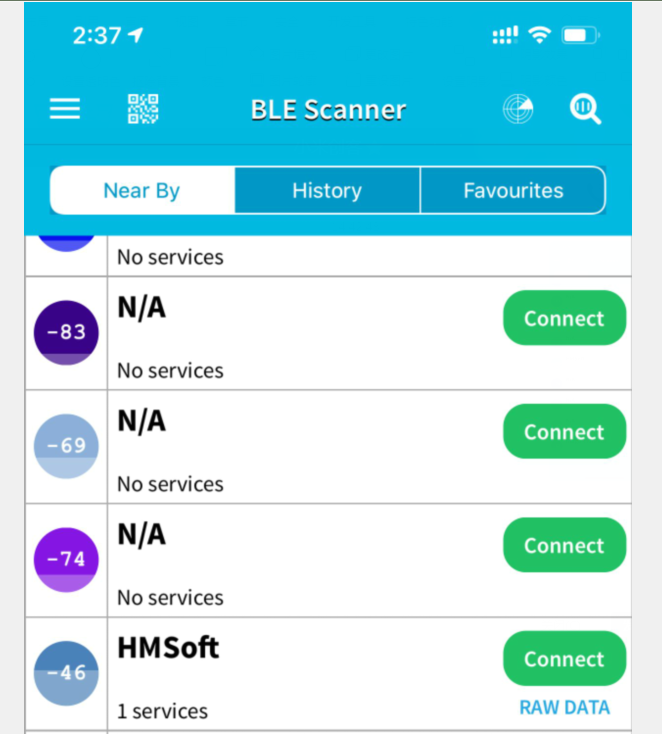

1.  After connecting to HMSoft, click it to get multiple options, such as device
    information, access permission, general and custom service. Choose “CUSTOM
    SERVICE”

1.  Then pop up the following page.

7\. Click（Read,Notify,WriteWithoutResponse)to enter the following page

8\. Click **Write Value to enter HEX or Text.**

1.  Open the serial monitor on Arduino，enter a 0 or other character on Text
    interface.

1.  Then click “Write”, open serial monitor to view if there is a “0” signal

(7) Extension Practice

We could send a command via Bluetooth to turn on and off a LED.

D3 is connected to a LED, as shown below:

The program will be generated if you find the following file and drag it into
Mixly software.

| File type | Route                                                              |
|-----------|--------------------------------------------------------------------|
| MIX File  | ../tutorial for Mixly/Mixly Code/lesson_7_Bluetooth Remote Control |
|           | File Name                                                          |
|           | lesson_7.2_Extension Practice                                      |

You could edit code step by step as follows:

1.  Click“Control” to get block

2.  Enter“Serial Port”to move
    blockinto

3.  Click“Variables” to move
    blockinto
    block，then go to “Math” to
    find out，

4.  Combine with
    and change item into i.

1.  Click “Control” to get
    block，and enter “Serial
    port”to moveinto if block.

1.  Go to“Variables”to drag
    blockinto do block，

2.  Enter “Serial port”to move
    outblock and edit code string
    as follows:

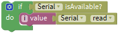

1.  Enter“Serial port” to drag
    out，

2.  Click“Text”to move outinto
    block，and change “hello”into
    DATA RECEIVED：.

1.  Click“Control”to move out
    blockinto do，click “Logic”
    to moveblock into if，

2.  Enter “Variables” to move
    into left box of “=”，then
    enter “Text” to get blockand
    leave it into right box“=”，change a into 1.

1.  Enter“Sensor”→“ControlOutput”→

2.  Drag it into the second do block，S end of red LED is connected to D3,
    therefore, set to Pin 3.

1.  Replicateonce and place it
    into the second do block. Change DATA RECEIVED：into led on.

1.  Copy code
    stringonce and change 1 into
    0，click “HIGH” to select “LOW”，and change led on into led off.

Complete Program：

Click “Write” on APP, when you enter 1, LED will be on, when you input 0, LED
will be off. (Remember to remove the Bluetooth module after finishing
experiment, otherwise, burning code will be affected)

**Hook-up diagram**

**1. STATE:** *state test pins, connected to internal LED, generally keep it
unconnected.*

**2. RXD:** *serial interface, receiving terminal.*

**3. TXD:** *serial interface, transmitting terminal.*

**4. GND:** *Ground.*

**5. VCC:** *positive pole of the power source.*

**6. EN/BRK:** *break connect, it means breaking the Bluetooth connection,
generally, keep it unconnected.*

**Pay attention to the pin direction when inserting Bluetooth module, and don’t
insert it before uploading test code**

### Project 8: Motor Driving and Speed Control

1.  **Description**

There are many ways to drive the motor. Our robot car uses the most commonly
used L298P solution. L298P is an excellent high-power motor driver IC produced
by STMicroelectronics. It can directly drive DC motors, two-phase and four-phase
stepping motors. The driving current up to 2A, and output terminal of motor
adopts eight high-speed Schottky diodes as protection.

We designed a shield based on the circuit of L298p.

The stacked design reduces the technical difficulty of using and driving the
motor.

1.  **
     Specification**

2.  Logic part input voltage: DC5V

3.  Driving part input voltage: DC 7-12V

4.  Logic part working current: \<36mA

5.  Driving part working current: \<2A

6.  Maximum power dissipation: 25W (T=75℃)

7.  Working temperature: -25℃～＋130℃

8.  Control signal input level: high level 2.3V\<Vin\<5V, low level
    \-0.3V\<Vin\<1.5V

**3. Drive Robot to Move**

Through the above diagram, the direction pin of B motor is D4, and speed pin is
D5; D2 is the direction pin of A motor, D9 is speed pin.

PWM decides 2 motors to rotate so as to drive robot car. The PWM value is in the
range of 0-255, the larger the number, the faster the motor rotates.

|                 | D2   | D6 (PWM） | Motor（A）           |
|-----------------|------|-----------|----------------------|
| Go forward      | LOW  | 200       | Rotate clockwise     |
| Go back         | HIGH | 200       | Rotate anticlockwise |
| Rotate to left  | HIGH | 200       | Rotate anticlockwise |
| Rotate to right | LOW  | 200       | Rotate clockwise     |
| Stop            | /    | 0         | Stop                 |
|                 |      |           |                      |
| Go forward      | D4   | D5 PWM    | Motor（B）           |
| Go back         | LOW  | 200       | Rotate clockwise     |
| Rotate to left  | HIGH | 200       | Rotate anticlockwise |
| Rotate to right | LOW  | 200       | Rotate clockwise     |
| Stop            | HIGH | 200       | Rotate anticlockwise |
| Go forward      | /    | 0         | Stop                 |
| Go back         | D4   | D5 PWM    | Motor（B）           |

**4. Components**

**5. Connection Diagram**

**6. Test Code：**

The program will be generated if you find the following file and drag it into
Mixly software.

| File type | Route                                                                     |
|-----------|---------------------------------------------------------------------------|
| MIX File  | ../tutorial for Mixly/Mixly Code/lesson_8_Motor Driving and Speed Control |
|           | File Name                                                                 |
|           | lesson_8.1_Motor Driving and Speed Control                                |

You could edit code step by step as follows:

(1)Click “Control” to get block.

(2) Go to
”Module”→”Drive_Module”→，

(3) Place it into block，

(4) The direction pin and speed control pin of B motor(left) are connected to D4
and D5. So set PIN 4 and PIN 5 as follows:

(5) Copyonce and place it into
block，

(6) The direction pin and speed control pin of A motor (right) are connected to
D2 and D9. So set PIN 2 and PIN 9 as follows:

1.  Duplicate code string
    once, set INA to HIGH and PWB
    to 200：

1.  Click “Control” to move out
    block，delay in 2000ms.

1.  Replicate
    for four times，then set the
    code string as follows:

Complete Program：

1.  **Test Result**

Hook up by connection diagram, upload code and power on, smart car goes forward
and back for 2s, turns left and right for 2s, stops for 2s and alternately.

1.  **Extension Practice**

The program will be generated if you find the following file and drag it into
Mixly software.

| File type | Route                                                                      |
|-----------|----------------------------------------------------------------------------|
| MIX File  | ../tutorial for Mixly/Mixly Code/ lesson_8_Motor Driving and Speed Control |
|           | File Name                                                                  |
|           | lesson_8.2_Extension Practice                                              |

You could edit code step by step as follows:

Complete Program：

Upload code successfully, the motors rotate slower.

### Project 9: 8*8 LED Board

1.  **Description：**

A fun way to make a small display is to use an 8x8 matrix or a 4-digit 7-segment
display. Matrices like these are 'multiplexed' - to control 64 LEDs you need 16
pins. That's a lot of pins, and there are driver chips like the MAX7219 that can
control a matrix for you, but there's a lot of wiring to set up and they take up
a ton of space. After all, wouldn't it be awesome if you could control a matrix
without tons of wiring?

We control and drive 8\*8 LED Board by HT16K33 chip, which is convenient for
wiring and greatly save the resources of microcontroller.

1.  **Components**

**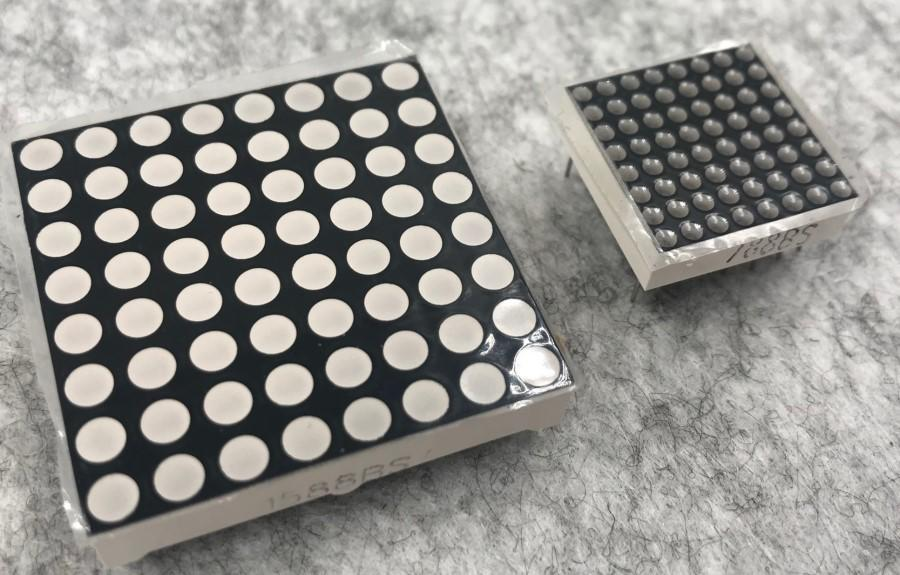8\*8 Dot Matrix**

Composed of LED emitting tube diodes, LED dot matrix are applied widely to
public information display like advertisement screen and bulletin board, by
controlling LED to show words, pictures and videos, etc.

Divided into single-color, double-color, and three-color lights according to
emitting color , LED dot matrix could show red, yellow, green and even true
color.

There are 4×4, 8×8 and 16×16 different types matrix.

8×8 dot matrix contains 64pcs LEDs.

The inner structure of 8×8 dot matrix is shown below.

Every LED is installed on the cross point of row line and column line. When the
voltage on some line increases, and the voltage on some column line is reduced,
the LED on the cross point will light up. 8×8 dot matrix has 16 pins. Put the
silk-screened side down and the anticlockwise numbers are 1,8, 9 and 16.

The definition inner pins are shown below:

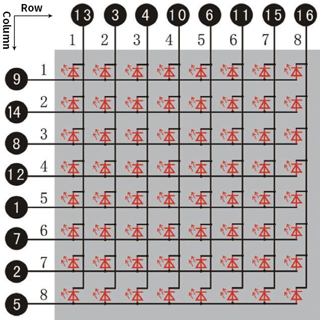

For instance, to light up the LED on row 1 and column 1, increase the voltage of
pin 9 and reduce the voltage of pin 13.

1.  **HT16K33 8X8 Dot Matrix**

The HT16K33 is a memory mapping and multi-purpose LED controller driver. The
max. Display segment numbers in the device is 128 patterns (16 segments and 8
commons) with a 13\*3 (MAX.) matrix key scan circuit. The software configuration
features of the HT16K33 makes it suitable for multiple LED applications
including LED modules and display subsystems. The HT16K33 is compatible with
most microcontrollers and communicates via a two-line bidirectional I2C-bus.

The working schematic of HT16K33 chip

We design the drive module of 8\*8 dot matrix based on the above principle. We
could control the dot matrix by I2C communication and two pins of micro
controller, according to the above diagram.

1.  **Specification of 8\*8 dot matrix**

Input voltage: 5V

Rated input frequency: 400KHZ

Input power: 2.5W

Input current: 500mA

4\. Introduction for Modulus Tool

The online version of dot matrix modulus tool:

[http://dotmatrixtool.com/\#](http://dotmatrixtool.com/)

① Open links to enter the following page.

①Open links to enter the following page.

②The dot matrix is 8\*16 in this project, so set the height to 8, width to 8, as
shown below.

Click Byte order to select “**Row major”**

③ Generate hexadecimal data from the pattern

As shown below, press the left mouse button to select, the right button to
cancel, draw the pattern you want, click **Generate**, and the hexadecimal data
we need will be produced.

The generated hexadecimal code(0x00, 0x66, 0x00, 0x00, 0x18, 0x42, 0x3c, 0x00)
is what we display, and save it.

1.  **Connection Diagram**

****

Note: The pin G, V, SDA and SCL of dot matrix module are separately connected to
G, 5V, A4 and A5 of motor drive shield. Plug power to BAT interface.

1.  Test Code：

The program will be generated if you find the following file and drag it into
Mixly software.

| File type | Route                                                     |
|-----------|-----------------------------------------------------------|
| MIX File  | ../tutorial for Mixly/Mixly Code/ lesson_9_8\*8 LED Board |
|           | File Name                                                 |
|           | lesson_9.1_8\*8 LED Board                                 |

You could edit code step by step as follows:

(1) Click “Control” to get block

(2) Enter“Module”→”Display_Module”→

1.  Go to “Display_Module” to get
    blockand leave it into
    block，and click drop-down
    triangle button to set“ON”.

1.  Move out blockfrom
    “Display_Module”，

Tick the white box to light up LED, “√”will appear and generate a smile face
pattern. As shown below:

Complete Program：

**8. Test Result**

Upload code, plug in power and turn on switch of smart car, 8\*8 dot matrix
displays a smile face pattern.

**9. Extension Practice：**

Let’s make dot matrix draw a heart, just enter the website and draw the
following pattern.

[http://dotmatrixtool.com/\#](http://dotmatrixtool.com/)

，

Then we get the code of heart pattern

Replace the above code of heart pattern, the complete code is shown below:

| File type | Route                                                     |
|-----------|-----------------------------------------------------------|
| MIX File  | ../tutorial for Mixly/Mixly Code/ lesson_9_8\*8 LED Board |
|           | File Name                                                 |
|           | lesson_9.2_Extension Practice                             |

You could edit code step by step as follows:

Complete Program：

Upload code, plug in power and turn on switch of smart car, 8\*8 dot matrix
displays a heart pattern.

### Project 10: Line Tracking Robot**

1.  **Description**

The previous projects are inclusive of the knowledge of multiple sensors and
modules. Next, we will work on a little challenging task.

We could make a line tracking car on top of the working principle of line
tracking sensor.

**Line tracking robot car:**

| Middle tracking sensor | detects black line：HIGH |
|------------------------|--------------------------|
|                        | detects white line：LOW  |
| Left tracking sensor   | detects black line：HIGH |

detects white line：LOW

Right tracking sensor

detects black line：HIGH

detects white line：LOW

Condition 1

Status 2 detecting the left and the right tracking sensor

Status

Middle tracking sensor detects black line

left tracking sensor detects black line; right sensor detects white line

Rotate to left

(Set PWM to 200）

left tracking sensor detects white line; right sensor detects black line

Rotate to right

(Set PWM to 200）

left and right tracking sensor detect black line

Go front（Set PWM to 200）

left and right tracking sensor detect white line

Go front（Set PWM to 200）

Middle tracking sensor detects white line

Only left line tracking sensor detects black line

Rotate to left（Set PWM to 200）

Only right line tracking sensor detects black line

Rotate to right（Set PWM to 200）

Left and right line tracking sensors detect black line

stop

Left and right line tracking sensors detect white line

stop

**Flow Chart**

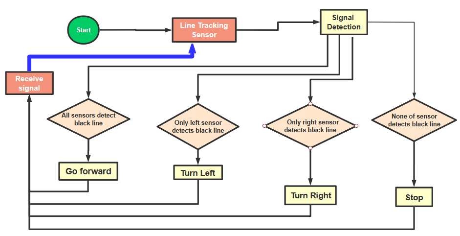

1.  **Connection Diagram**

****

1.  **Test Code**

The program will be generated if you find the following file and drag it into
Mixly software.

| File type | Route                                                           |
|-----------|-----------------------------------------------------------------|
| MIX File  | ../tutorial for Mixly/Mixly Code/ lesson_10_Line Tracking Robot |
|           | File Name                                                       |
|           | lesson_10_Line Tracking Robot                                   |

You could edit code step by step as follows:

1.  Go to“Control”Module to find out
    block.

2.  Click“Variables”to move out
    blockand duplicate it for two
    times.

(3) Separately change item into val_L, val_C and val_R.

(4) Go to“Math”to move out
blockand copy it twice.

(5) Edit the following code string:

(6) Go to “Variables” to get
block.

(7) Tap“robot”→“TurtleCar”to move out
block

+
=

(8) Duplicate blocktwice，then
change val_L into val_C and val_R; left_tracking into center_tracking and
right_tracking. 

(9) Click“Control”to get block ，
click，and
moveinto
，
thenblock turns
intoblock.

1.  Click“Logic”to move out
    blockand place it behind if
    block. Go to“Variables”to drag out
    blockinto left box of “=”
    block，

(11) Copyagain and leave it into
right box of“=”b lock，and change 0 into 1.

(12) Tap“Robot”→“TurtleCar”→

(13) Put it under block val_C=1, and change 0 into 200.

(14) Go to“Control”to move
blockinto else
block，click，drag
blockinto
block and move
blockinto
block，
thenblock turns into
block.

(15) Click“Logic”to move out
block
and

(16) Place behind if block, and
leavein the left box of
“and”block.

(17) Go to“Variables”to drag out
blockinto left box of“=”block，

(18) Copyagain and leave it into
right box of“=”b lock，and change 0 into 1.

(19) Copy block once and keep it
in the right box of “and”block, change val_L into val_R, 1 into 0

1.  Click "robot" → "TurtleCar" →

Place it behind the second do block and set to 200 PWM

1.  Replicate blockonce and leave
    it behind else if.

2.  Set to“val_L=0 and val_R=0

1.  Click "robot" → "TurtleCar” →

Place it behind the third do block, and set to 200 PWM

1.  Drag out block and keep it
    behind the second else block

Complete Program：

1.  **Test Result**

Upload code on the development board, plug in power and turn on the switch of
smart car. The smart turtle car will walk along the black line.

### Project 11: Ultrasonic Follow Robot

**1. Description**

In this project, we detect the distance value of the obstacle to drive two
motors so as to make robot car move and 8\*8 dot matrix show smile face pattern

Control the motor rotating by measured data, thus control the motion of robot
car.

The specific logic of ultrasonic follow robot car is as shown below:

| Detection | Measured distance of front obstacles |
|-----------|--------------------------------------|
| Setting   | Set the angle of servo to 90°        |
| Condition | Distance＜8                          |
| Status    | Go back（set PWM to 200）            |
| Condition | distance≥8 and distance＜13          |
| Status    | Stop                                 |
| Condition | distance≥13 and distance＜35         |
| Status    | Go front（set PWM to 200）           |
| Condition | distance≥35                          |
| Status    | stop                                 |

Flow Chart

**2. Program Process**

Below is app of turtle robot car interface and we have listed out what function
of each key does

| Pair Bluetooth module |                                    |
|-----------------------|------------------------------------|
| Enter control page    |                                    |
| Disconnect Bluetooth  |                                    |
| Press: F Release: S   | robot goes front; release to stop  |
| Press: L Release: S   | robot turns left; release to stop  |
| Click to send “S”     | Stop                               |
| Press: R Release: S   | robot turns right; release to stop |
| Press: B Release: S   | robot goes back; release to stop   |
| Click to send “Y”     | Start Ultrasonic follow function   |
| ---                   |                                    |
| Click to send “U”     | Start ultrasonic avoiding function |
| Click to send “X”     | Start line tracking function       |

1.  **Flow Chart**

****

1.  **Connection Diagram**

****

1.  **Test Code**

The program will be generated if you find the following file and drag it into
Mixly software.

| File type | Route                                                              |
|-----------|--------------------------------------------------------------------|
| MIX File  | ../tutorial for Mixly/Mixly Code/lesson_11_Ultrasonic Follow Robot |
|           | File Name                                                          |
|           | lesson_11_Ultrasonic Follow Robot                                  |

You could edit code step by step as follows:

1.  Enter“Serial Port”to move
    blockinto

+
=

1.  Go to“Variables”to move
    blockinto
    block，enter“Math”to drag
    blockinto
    block，and change item into
    distance. 

2.  Click“robot”→“TurtleCar”→

3.  Leave it under block “Declare distance as...0”and change 0 into 90

1.  Go to "Variables" to move out
    block，

Enter "robot" → "TurtleCar" → 

1.  +
=

2.  Go to “serial”to moveblock
    out, and
    combinewith
    

1.  Click “Control” to move out
    block，
    tap，
    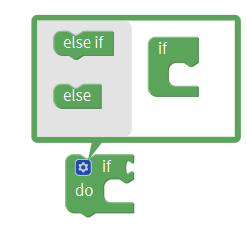appears, drag
    into
    blockfor 2 times and move
     into if block, then the
    blockis produced.

2.  Enter “Logic” to move block
    into if block

3.  Go to “Variables” to drag
    blockinto left box of “=”

4.  Click “Math” to move out block
    into right box of “=”, change
    0 into 8, and “=” into “\<”.

1.  Click "robot" → "TurtleCar"→

2.  Put it behind “do” block and set to 200 PWM.

1.  Go to“Logic”to move out
    blockand combine with else if
    block.

2.  Replicate blocktwice and
    place them at both side of “and” block and edit the code string as follows：

1.  Click "robot" → "TurtleCar" →

2.  Combine it with the second do block.

1.  Copy blockonce

2.  Place it behind the second else if block，and edit the code string as below:
    

3.  Drag outand
    from "TurtleCar"，and finish
    the code string as follows:

Complete Program：

1.  **Test Result**

Upload the code to the development board, plug in power and turn on the switch
of smart car. Adjust the servo on turtle robot car to 90°, robot car will follow
the obstacle to move((robot car only moves forward and backward).

### Project 12: Ultrasonic Avoiding Robot

****

1.  **Description**

We’ve learned LED matrix, motor drive, ultrasonic sensor and servo in previous
lessons. Next, we could make an ultrasonic avoiding robot!

The measured distance between ultrasonic sensor and obstacle can be used to
control servo to rotate so as to make robot car move.

The specific logic of ultrasonic avoiding smart car is as shown below:

  |
|-|
| MIX File  | ../tutorial for Mixly/Mixly Code/lesson_12_Ultrasonic Avoiding Robot |
|           | File Name                                                            |
|           | lesson_12_Ultrasonic Avoiding Robot                                  |

You could edit code step by step as follows:

1.  Go to“Control” to find out
    block.

2.  Separately change item into distance1, distance2 and distance3.

3.  Go to “Math” to move out
    blockand copy it for three
    times

4.  Edit the following code string:

1.  Enter "robot" → "TurtleCar" →
    , change 0 into 90

2.  Drag out  from“Control”and
    delay in 300ms.

3.  Edit the code string as follows:

1.  Then move out block
    and
    and place them into block.

1.  Go to "Variables" to drag out
    block，and move out
     from "TurtleCar"，

+
=

1.  Click “Control” and drag it into
    block，click
    and moveinto
    then we get
    block.

2.  Go to “Logic” to get  and
    .

3.  Place into if block，and
    leave  in the left box of
    block.

4.  Enter “Variables” to get
    block and keep it at left box
    of block “=”.

5.  Go to “Math” to move outinto
    right box of block “=”, change “=” into“≠”. Replicate
    blockonce and set code string
    as follows:

1.  Go to "robot" →
    "TurtleCar"→,
    
    and

2.  Place them behind do block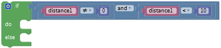，

3.  Click  to select“STOP”，and
    move out  and set to 100ms.
    As shown below:

1.  Click "robot" → "TurtleCar"
    →, change 0 into 180.

2.  Copy once and set to 500ms.

3.  Edit the code string as follows:

1.  Duplicate
    blockand

2.  Change distance1 into distance2, and 1000 into 100.

3.  Finish the following code string as follows:

1.  Duplicate code stringonce and
    change 180 into 0, distance2 into adistance3.

2.  Place it under block “Delay ms 100”

1.  Click “Control” and drag it into
    block，
    click and
    move
    into then we get
    block.

2.  Go to “Logic” to move out
    blockinto if block，then
    click“Variables”to drag
    blockinto left box
    of“=”block，and move
    blockinto right box
    of“=”，and change“=”into“＞”.

1.  Find out block,
    
    and from"TurtleCar"

2.  Place them behind do block of code
    string.

3.  Set to 200 PWM and click to
    select“←”

1.  Move out blockand leave it
    under blockand change 0 into
    90.

2.  Copy blockand set to 400ms,
    as shown below:

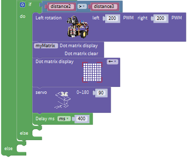

1.  Then drag out blockand
    

2.  Place them below block “delay ms 400” and
    tap to choose“↑”.

1.  Go to "TurtleCar" to move block
    behind else block，

2.  Copy code stringonce and
    place it into else block.

3.  Set to 200 PWM and delay in 500ms. Click“←”to choose“→”.
    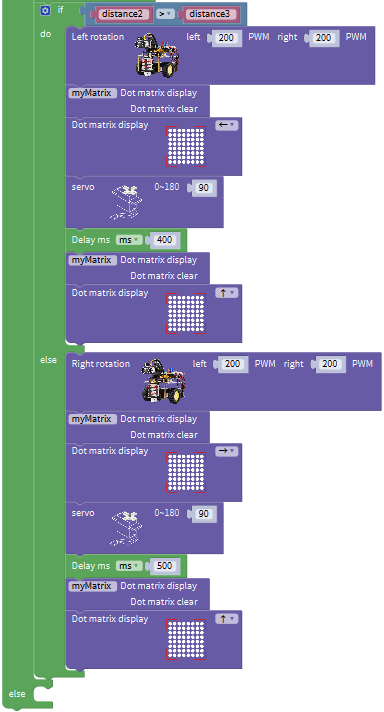

4.  Move out block,
    
    and

5.  Change 0 into 200, click  to
    select“↑”.

6.  Leave the above blocks into else block, as shown below:
    

Complete Program：

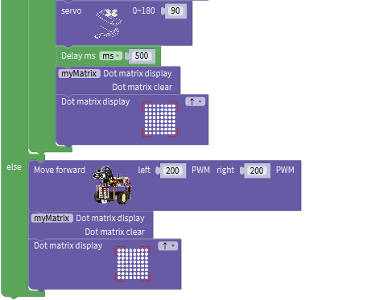

1.  **Test Result**

After uploading the code on the keyestudio V4.0 board, wire according to
connection diagram. Turn on the switch of robot car, the smart car can
automatically avoid obstacles.

### Project 13: IR Remote Control Robot

1.  **Description**

In this project, we will make IR remote control robot car!

Press the button on IR remote control to drive robot car to move, and the
corresponding state pattern is displayed on the 8\*16 LED matrix.

The specific logic of IR remote control robot car is shown below:

| Remote control                                        |                        
|-------------------------------------------------------|
| Go front（PWM set to 100）           |
|                                                       |
 8\*8 LED matrix shows front icon     |
| FFA857 | 
Back（PWM set to 100）               |
|                                                       | 
8\*8 LED matrix shows back icon      |
| FF22DD |
 Rotate to left（PWM set to 200）     |
|                                                       | 
8X16 LED matrix shows leftward icon  |
| FFC23D | 
Rotate to right（PWM set to 200）    |
|                                                       |
 8X16 LED matrix shows rightward icon |
| FF02FD | 
Stop                                 |
|                                                       | 
8X16 LED matrix shows“STOP”          |

1.  **Flow Chart**

1.  **Connection Diagram**

****

**Note: IR receiver is connected to P4 interface.**

1.  **Test Code**

The program will be generated if you find the following file and drag it into
Mixly software.

| File type | Route                                                               |
|-----------|---------------------------------------------------------------------|
| MIX File  | ../tutorial for Mixly/Mixly Code/ lesson_13_IR Remote Control Robot |
|           | File Name                                                           |
|           | lesson_13_IR Remote Control Robot                                   |

You could edit code step by step as follows:

1.  Click“Control” to get block

(2) Enter“Serial Port”to move
blockinto

+
=

(3) Go to "robot" →
"TurtleCar"→blockand
,

Combine them with block

(4) Enter "robot" → "TurtleCar"
→，then click "SerialPort" to
drag blockinto
block，

(5) Tap "Variables" to move block
into blank box of block

1.  Click“Control”to move out
    block，
    click，
    tap，
    appears, drag
    into
    blockfor 5 times，the
    block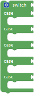is produced.

2.  Click "Variables" to move
    blockbehind block“switch”.

1.  Go to“Math”to get blockand
    put it behind the first block case，change a into 0xFF629D；

2.  Enter "robot" → "TurtleCar"→,
    
    and

3.  Place the above blocks under the first block case, change 0 into 200，and
    click to select“↑”

1.  Go to“Math”to get blockand
    put it behind the second block case，change a into 0xFFA857；

2.  Enter "robot" → "TurtleCar"→,
    
    and

3.  Place the above blocks under the second block case, change 0 into 200，and
    click to select“↓”.

1.  Go to“Math”to get blockand
    put it behind the third block case，change a into 0xFF22DD；

2.  Enter "robot" → "TurtleCar"→,
    
    and

3.  Place the above blocks under the third block case, change 0 into 200，and
    click to select“←”.

1.  Go to“Math”to get blockand
    put it behind the fourth block case，change a into 0xFFC23D；

2.  Enter "robot" → "TurtleCar"→,
    
    and

3.  Place the above blocks under the fourth block case, change 0 into 200，and
    click to select“→”.

1.  Go to“Math”to get blockand
    put it behind the fifth block case，change a into0xFF02FD；

2.  Enter "robot" → "TurtleCar"→,
    
    and.

3.  Place the above blocks under the fourth block case, change 0 into 200，and
    click to select“STOP”.

Complete Program：

1.  **Test Result**

Upload the code and press the buttons on IR remote control to make turtle car
show different motion.

### Project 14: Bluetooth Control Robot

****

1.  **Description：**

We’ve learned the basic knowledge of Bluetooth, in this lesson, we will make a
Bluetooth remote smart car. In the experiment, we default the HM-10 Bluetooth
module as a Slave and the cellphone as a Host.

keyes BT car is an APP rolled out by keyestudio team. You could control the
robot car by it readily.

Special Note: you need to remove the Bluetooth module before uploading the test
code, otherwise the test code will fail to upload.

Reconnect the Bluetooth module, after uploading code successful.

The program will be generated if you find the following file and drag it into
Mixly software.

1.  **Test the key value of app**

Special Note: Before uploading the test code, you need to remove the Bluetooth
module, otherwise the test code will fail to upload. After the code is uploaded
successful, then reconnect the Bluetooth module.

The program will be generated if you find the following file and drag it into
Mixly software.

| File type | Route                                                             |
|-----------|-------------------------------------------------------------------|
| MIX file  | ../tutorialforMixly/MixlyCode/ lesson_14_Bluetooth Remote Control |
|           | File Name                                                         |
|           | lesson_14.1_Bluetooth Reads Data                                  |

You could edit code step by step as follows:

(1) Go to“Control”Module to find out
block.

(2) Enter“Serial Port”to move
blockinto

+
=

(3) Go to "robot" → "TurtleCar"
→.

(4) Click "SerialPort" to move block
into
；enter "Variables" to drag
blockinto

Complete Program：

Upload code to keyestudio V4.0 development board and connect Bluetooth module,
as shown below:

****

After inserting a Bluetooth module, LED on Bluetooth module will flash. Next to
download the App.

The pin RXD, TXD, GND and VCC of Bluetooth module are connected to TX, RX,
\-（GND）and +（VCC）on motor drive board. The pin STATE and BRK don’t need to be
linked.

The pin G, V, SDA and SCL of dot matrix are linked with pin G, 5V, A4 and A5 of
motor drive board. The power is plugged in BAT interface.

**iOS system**

Search keyes BT car in App store

After installation, enter its interface.

Click“Connect”to search and pair Bluetooth.

Clickto enter the main page of
turtle smart car.

**Android System**

1\. Enter Google play store to search Turtle Car(**allow APP to access“location”,
you could enable “location”in settings of your cellphone.**

1.  The app icon is shown below after installation.

    

2.  Click app to enter the following page.

1.  After connecting Bluetooth, plug in power and LED indicator of Bluetooth
    module will flash. Tap to search Bluetooth.

    

Click“connect”below HMSoft, then the Bluetooth will be connected and its LED
indicator will stay on.

After connecting Bluetooth module and open serial monitor to set baud rate to
9600\. Press icon on APP, and the corresponding characters are displayed as shown
below:

1.  **Hook-up Diagram**

****

1.  **Test Code**

The program will be generated if you find the following file and drag it into
Mixly software.

| File type | Route                                                               |
|-----------|---------------------------------------------------------------------|
| MIX File  | ../tutorial for Mixly/Mixly Code/lesson_14_Bluetooth Remote Control |
|           | File Name                                                           |
|           | lesson_14.1_Bluetooth Control Smart Car                             |

You could edit code step by step as follows:

(1) Click “Control” to find out
block.

(2) Enter “Serial Port” to move
blockinto

+
=

(3) Enter "robot" →
"TurtleCar"→and
;

(4) Place them into block.

(5) Enter "robot" → "TurtleCar"
→，

Go to "SerialPort" to move
blockinto
block; and click "Variables" to
drag blockbehind
block.

1.  Click“Control”to drag out
    block，
    clickand appear
    box，drag
    blockfor five times and place
    them into block，then we get
    block;

2.  Click "Variables" to place
    blockbehind the block“switch”

1.  Click "Text" to move blockout
    and keep it behind the first case block，change a into F；

2.  Click "robot" → "TurtleCar"→,
    
    and

3.  Place them under case block, change 0 into 200 and
    tapto select“↑”.

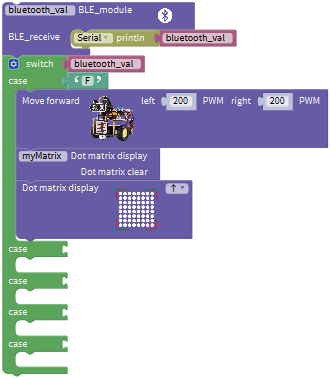

1.  Copy blockand place it behind
    the second case，alter a into B；

Go to "robot" → "TurtleCar"→,

and

1.  Put the above blocks under the second case block, change 0 into 200 and
    clickto select“↓”.

1.  Replicate blockonce and leave
    it behind the third case block，modify a into L；

2.  Click "robot" → "TurtleCar"→,
    
    and

3.  Put the above blocks under the third case block, change 0 into 200 and
    tap to choose“←”.

1.  Replicate  twice and place
    them behind the fourth and fifth case blocks respectively.

2.  Go to "robot" → "TurtleCar"→,
    ,
    ,
    ,
    and
    .

3.  Change 0 into 200, click  to
    select“→”and“STOP”, a into R and S.

Complete Program：

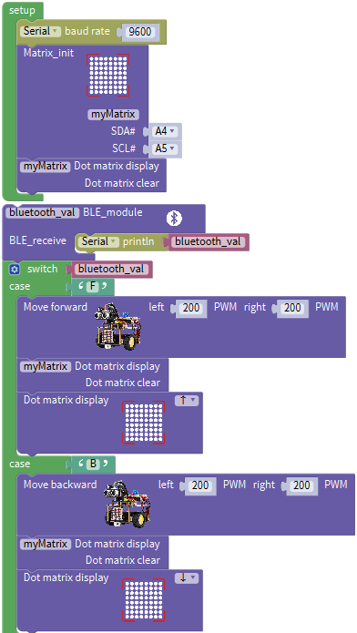

1.  **Test Result**

Upload program to development board, insert Bluetooth module, open App to
connect Bluetooth. Next, press icons on App to control turtle robot car to move.

Special Note: you need to remove the Bluetooth module before uploading the test
code, otherwise the test code will fail to upload.

Reconnect the Bluetooth module, after uploading code successful.

### Project 15: Multi-purpose Bluetooth Robot

1.  **Description**

In previous projects, the robot car only performs single function, however, in
this lesson, we integrate all of function to control smart car via Bluetooth

Here is a simple flow chart of multi-purpose robot car as for your reference.

1.  **Connection Diagram**

1.  **Test Code**

The program will be generated if you find the following file and drag it into
Mixly software.

| File type | Route                                                                    
|
| MIX File  | ../tutorial for Mixly/Mixly Code/lesson_15_Multi-purpose Bluetooth Robot |
 File Name                                                                |
|           | lesson_15_Multi-purpose Bluetooth Robot                                  |

Complete Program：

1.  **Test Result**

Upload the code on the keyestudio V4.0 board. Turn on the switch on robot car.
After connecting to Bluetooth, we could control turtle robot car via App.

## 8. Resources

Wiki page: <https://wiki.keyestudio.com/Main_Page>

Official website: <https://keyestudio.com/>
